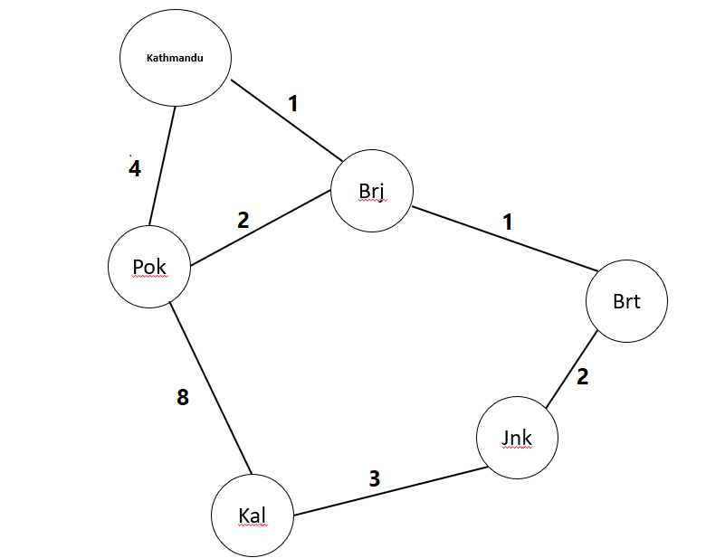

# Dijkstra's Algorithm
- It is used to find single source shortest path. 
- It works for the weighted graph. For unweighted graph we can use BFS. 
We use adjacency list to implement graph. Because it is the most efficient method
to reprsent graph as it is time efficient.

### Adjacency List

 
     
    Key(String)   List of Pairs(String,int)
    Kathmandu -> (Pok,4)(Brj,1)
    Pok       -> (Kal,8)(Brj,2)
    Kal       -> (Pok,8)(Jnk,3)
    Jnk       -> (Kal,3)(Brt,2)
    Brt       -> (Brj,1)(Jnk,2)
    
   
 So we can do this by maintaining a Hashmap by storing ever key and value.You can make a
 generic type to make it work for any type of key and value. 
  
    hashmap<T,list<pair<T,int>> h
    
 ## Algorithm
     
     - Make the distance of source node 0.
     - Make all the distances of nodes infinity except the source.
     
    
