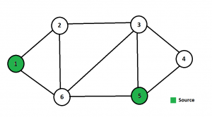
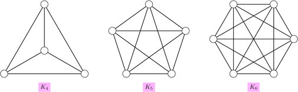
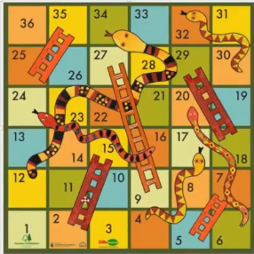

# Graph
Graph is a data structure which is reprseneted by finite set of nodes and edges.
These nodes are called vertices and edges are used to connect vertices. 
Applications :-  
1.Google Maps 
2.Social Networks like Facebook,Quora,Linkedin.Friend suggestion and recommendation
is done due to this. 
3.Routing Algorithms

## Components of Graph
i.Adjacent vertices 
Two Vertices which are directly connected by an edge. 
ii.Degree 
No of edges connected to a vertices. 
iii.Path 
Set of edges from source node to destination node. 
iv.Connected Graph 
A connected graph is a graph in which it's possible to get from every vertex 
in the graph to every other vertex through a series of edges, called a path. 
v.Tree 
A tree is acyclic graph 
vi.Forest 
A collection of tree is called forest 
vii.Minimum Spanning Tree 
A subgraph of a graph containing all the vertices and subset of edges and weight along
the edges are minimum. 

## Types Of Graph 
1.Unweighted Graph 
Edges donot have weight associated with them or edges have equal weights. 
 
2.Weighted Graph 
Edges have weight associated with them . 
 

## Types of edges
1.Undirected Weighted Edges 
-A simple network of friends,bi-directional roads. 
2.Directed Weighted Edges 
-One way Distance from one end to another end. 
3.Bi-Directional Weighted Edges 
-Flight cost from mumbai to delhi and delhi to mumbai. 

## No of edges in Graph
1.Complete Graph 
Every node is connected to every other node. 
 

## Implementing Graph
1.Edge List 
We make a list of vertex.We take edges connection list. 
2.Adjacency Matrix 
If we have 5 vertices,we make 5*5 matrix and mark true is there is edges between those
two vertices.In case of weighted graph we store the edge weight instead of true or false.
It is not efficient to find out adjacent vertices of particular node.We need to traverse
that row and see for it. Complexity :- O(V).Takes alot of memory. For 1000 vertices we will
waste memory 10^6. Takes memory O(v^2). 
3.Adjacency List 
We can make a hashmap of key-value pairs or array of linked list. To see the neighbors
we can simply traverse the linked list which complexity will be less than O(V) and it is
also memory efficient. 
See adjacentlist.cpp for code related information. 

## Graph Traversal
1. Breadth First Search 
2. Depth First Search 

# Breadth First Search
i. It is an graph traversal method. 
ii. It is an iterative approach. 
iii. It uses a Queue to maintain FIFO ordering and another data structure is used to maintain the list of vertices visited so far. 
iv. It is like level-order traversal in binary tree. 
For a better understanding check the above bfs ppt.
PseudoCode
    
    void BFS(int G[][7],int start,int n){
     int i=start,j;
     //Visited vertex array
     int visited[7]={0};
     //Source Vertex
     printf("%d ",i);
     //Mark visited
     visited[i]=1;
     //Push the element in Queue
      enqueue(i);
      while(!isEmpty()){
         //Pop An ELement
           i=dequeue();
           //Check for the adjacent vertex of the poped element.
           //If present and not visited then push it.
            for(j=1;j<n;j++){
                if(G[i][j]==1 && visited[j]==0){
                    printf("%d ",j);
                    visited[j]=1;
                    enqueue(j);
                }
            }
        }
        //If the queue becomes empty then BFS is over.
    }

## Application
### Single Source Shortest Path
Use a queue and a distance array.
Initialise all the distance to infinity.
Make the distance of starting node a zero. 
        
        distance[child]=distance[parent]+1.

So push the source in the queue.And then i pop out this node .
And push the neighbours which arent visited.Neighbours will be at distance 1.
Subsequently neighbours are assigned distance.And you can check if a weight is 
assigned once you dont need to push it.Check singleSourceShortestpath.cpp

#### Snakes And Ladder Problem
You are given a board where it contain snakes and ladder.If you climb a stair you
reach a higher point and if bitten by snake then you reach lower point.You are given a dice
and you can throw your choice of number.Minimum number of dice moves to win the game.
 

 
Sample Output
Min Moves :- 4 
One Possible Shortest Path : 1 ->15->29->30->36 
